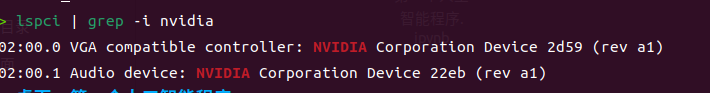
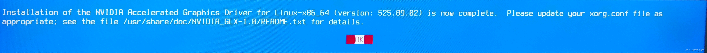
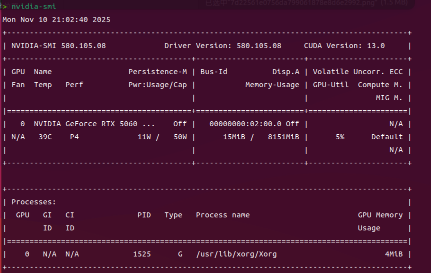
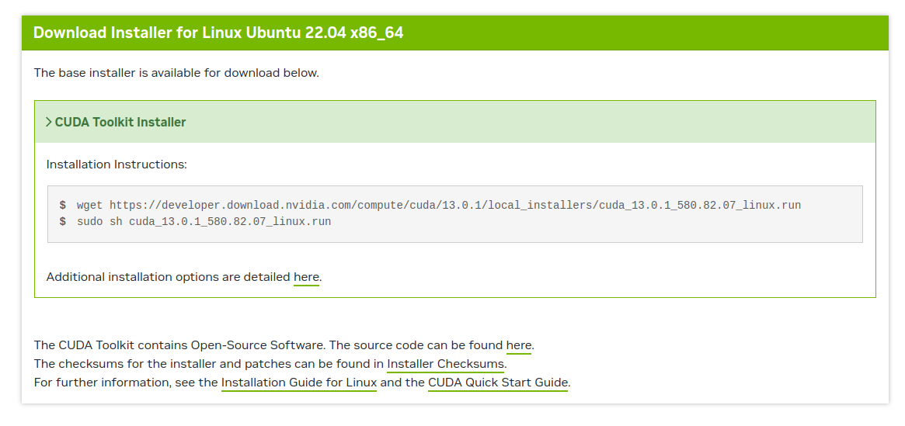
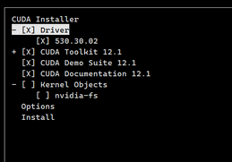
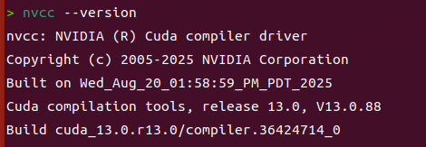
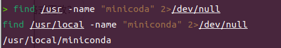

# 关于装 NVIDIA、CUDA、Miniconda 的建议

[TOC]

*Ubuntu22.04系统*

### 一、NVIDIA显卡驱动

#### 1.1 查看型号，挑选合适

```shell
lspci | grep -i nvidia
```



如图，可见型号为`2d59`。

据此去[PCI devices](https://admin.pci-ids.ucw.cz/mods/PC/10de?action=help?help=pci)查询找相应的显卡型号。


`Jump`就行，看看自己的型号。

然后去[英伟达驱动](https://www.nvidia.cn/Download/Find.aspx?lang=cn&QNF=1)下载。

这里他网站里面有引导，不作详述。

#### 1.2 安装依赖，做好准备

把`run`文件移动到主目录下——如果你是**中文**系统这一步是必要的。要不然在`tty`里全是乱码，用`ls`你都找不到`run`文件。

##### (1) 下载依赖

主要是：

```shell
sudo apt-get update
sudo apt-get install g++ gcc make
```

**注意版本要求，一般来说驱动版本越高，所需版本越高。如果后面下载有错误，`cat`日志，复制下来问AI（自己要是可以看懂就不用问AI）。**

**我就有一次按错了，他要的`gcc`版本比我的要高。**

##### (2) 禁用原有驱动

然后禁用默认驱动`nouveau`，进入文件：

```shell
sudo nano /etc/modprobe.d/blacklist.conf
```

在文件末尾加两行：

```shell
blacklist nouveau
options nouveau modeset=0
```

更新：

```shell
sudo update-initramfs -u
```

重启电脑：

```shell
reboot
```

**要养成习惯，改这类文件必要`update`和`reboot`。如果发现自己改了没用，不妨重启一下。**

##### (3) 安装`lightdm`

也可以直接用`gdm3`，大差不差。

```shell
sudo apt-get install lightdm
```

要安，可以自己改壁纸。

#### 1.3 开始安装

首先，到`tty`操作（1 - 6都可以）。

具体操作，`Ctrl + alt + F7`这是从`tty`回来的操作，先告诉你别回不来了。

之后`Ctrl + alt + F1`才是进入`tty1`的操作（也可以去23456），进入后输入用户名，密码，就正式进入了。

此外还可以：

```shell
sudo telinit 3
```

手动停止显示。

接下来，禁用X-window服务，可以提供安装环境。

```shell
sudo service gdm3 stop
```

或者（用`lightdm`）：

```shell
sudo service lightdm stop
```

这里你再用`Ctrl + alt + F7`会发现，会不去了！

放心，把`stop`改成`start`就可以回去了，直接回去。

不过，先别改，把驱动安了再改。

来，先赋予它权限：

```shell
sudo chmod 777 NVIDIA-Linux-x86_64-580.105.00.run # 这里是你的文件名
```

这里`777`是最高权限。

由于在`tty`，所以可以`ls`看看文件名。

```shell
sudo ./NVIDIA-Linux-x86_64-580.105.00.run # 这里是你的文件名
```

启动！

#### 1.4 安装之中

不懂就拍照问AI。如果报错，即有`error`，也问AI。

这里大概率`cat`就可以知道问题。

看到这个：



胜利了！

出来在`tty`打一下：

```shell
nvidia-smi
```

我这是在结束后打的，但都一样。



最后就是：

```shell
reboot
```

重启。

大体完毕。

### 二、CUDA安装

#### 2.0 什么是CUDA

CUDA是NVIDIA推出的通用并行计算平台和编程模型，用于通过GPU的并行计算能力加速科学计算、人工智能等领域的任务。（来自百度）

#### 2.1 依旧挑选，然后下载

从这[查询](https://docs.nvidia.com/cuda/cuda-toolkit-release-notes/index.html)里看。

一般来说，你装最新的就行——随便装。

从这[下载](https://developer.nvidia.com/cuda-toolkit-archive)看看。

选系统巴拉巴拉，然后版本——最后下载`run`文件，好操作。

他也有引导：

照做。

#### 2.2 安装之中

**不用进`tty`的说。**

依照以上步骤之后。

会出现大框——输入`accept`安装。

**注意 ！注意！注意！**

如果你已经下好了 Nvidia 驱动，就把第一项安装驱动勾掉。



之后，移到最后一项`Install`下载就好了。

#### 3.3 环境配置

打开配置文件：

```shell
sudo nano ~/.bashrc
```

在末尾输入：

```python
export PATH="/usr/local/cuda-13.0/bin:$PATH"
export LD_LIBRARY_PATH="/usr/local/cuda-13.0/lib64:$LD_LIBRARY_PATH"
```

然后，依旧更新：

```shell
source ~/.bashrc
```

**Or** 也可以直接：

```shell
echo 'export PATH=/usr/local/cuda-13.0/bin:$PATH' >> ~/.zshrc
echo 'export LD_LIBRARY_PATH=/usr/local/cuda-13.0/lib64:$LD_LIBRARY_PATH' >> ~/.zshrc
source ~/.zshrc
```

之后重启。

检验：

```shell
nvcc --version
```



可以了。

### 三、下载Miniconda

#### 3.0 什么是Miniconda

‌**Miniconda是一个轻量级的Python环境管理工具，主要用于创建、管理和切换隔离的Python环境，并高效处理包依赖问题**‌，它作为Anaconda的精简版，仅包含conda包管理器和Python解释器等核心组件，适合需要灵活定制环境的用户。‌‌(百度AI总结的)

你也可以装Anaconda。

#### 3.1 下载`sh`包

在 [Miniconda](https://mirrors.tuna.tsinghua.edu.cn/anaconda/miniconda/)官网中下载。

推荐3.10版本——我这里是2025.11.10。

看情况下。

可以直接点他的连接下。

**Or** 也可以用`wegt`下：

```shell
wget https://mirrors.tuna.tsinghua.edu.cn/anaconda/miniconda/Miniconda3-py310_25.9.1-1-Linux-x86_64.sh
```

#### 3.2 安装它吧

```shell
sudo bash Miniconda3-py310_25.9.1-1-Linux-x86_64.sh
```

按照它的步骤来。

看不懂？

问AI，让其去翻译。（我不想再装一遍了）

总之，先是`Enter`后`yes`。之后设置路径 `>>> /usr/local/minicoda`，就行——你也可以把他安在其他地方。

最后还是`Enter`。

#### 3.3 环境配置

依旧：

```shel
sudo nano /etc/profile
```

在末尾加上：

```python
export PATH=/usr/local/miniconda/bin:$PATH # 这里路径就是之前你设置的
```

更新：

```shell
source /etc/profile
```

验证：

```shell
conda --version
```


大功告成！

### 四、我的经历 & 报错

被困在`tty`里出不来。

很可怕了。

#### 4.1 如果以上有些工具没有

自己下。

#### 4.2 如果显卡安装看不懂

问AI。

实在不行，找以下几点：

**`run`文件版本对否？**

**安装依赖否？**

**安装依赖版本对否？**

**关掉X-window否？**

**选项选对否？**

无了。

#### 4.3 如果CUDA出问题了

那就用第二个方案（**Or**后面的）。

#### 4.4 如果Miniconda出问题了

设置路径一定要记住。

也可以：

```shell
find /usr -name "minicoda" 2>/dev/null
find /usr/local -name "miniconda" 2>/dev/null
```

查找一下。



一般会出的。

### 五、感谢 & 来源

可以看[Ubuntu 20.04安装显卡驱动](https://blog.csdn.net/sdbyp/article/details/139853774?ops_request_misc=%7B%22request%5Fid%22%3A%223bb68175ce9037e89d766436e07e1b73%22%2C%22scm%22%3A%2220140713.130102334..%22%7D&request_id=3bb68175ce9037e89d766436e07e1b73&biz_id=0&utm_medium=distribute.pc_search_result.none-task-blog-2~all~top_positive~default-1-139853774-null-null.142^v102^pc_search_result_base1&utm_term=ubuntu安装nvidia显卡驱动&spm=1018.2226.3001.4187)。

很全，还有`Pytorch`。

也可看[Ubuntu安装NVIDIA驱动](https://blog.csdn.net/OTZ_2333/article/details/108604064?ops_request_misc=&request_id=&biz_id=102&utm_term=ubuntu安装nvidia显卡驱动&utm_medium=distribute.pc_search_result.none-task-blog-2~all~sobaiduweb~default-1-108604064.142^v102^pc_search_result_base1&spm=1018.2226.3001.4187)，这个有安装中的图片。

谢谢我的舍友，可以容忍我深夜下载。
